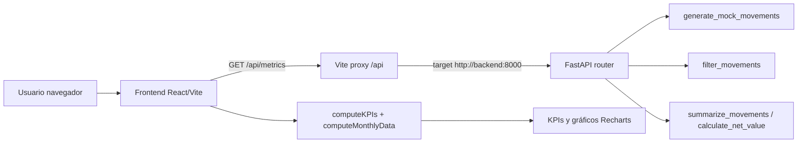

# Auditoría técnica del proyecto

## Índice

1. [Resumen ejecutivo breve](#1-resumen-ejecutivo-breve)
2. [Stack tecnológico](#2-stack-tecnológico)
3. [Arquitectura del sistema](#3-arquitectura-del-sistema)
4. [Patrones y decisiones de implementación](#4-patrones-y-decisiones-de-implementación)
5. [Scripts y arranque](#5-scripts-y-arranque)
6. [Mapa de trazabilidad frontend-backend](#6-mapa-de-trazabilidad-frontend-backend)
7. [Calidad y pruebas](#7-calidad-y-pruebas)
8. [Riesgos técnicos y deuda (priorizado)](#8-riesgos-técnicos-y-deuda-priorizado)
9. [Sección de vacíos de información](#9-sección-de-vacíos-de-información)
10. [Checklist de verificación final](#10-checklist-de-verificación-final)
11. [Inconsistencias encontradas](#inconsistencias-encontradas)

## 1. Resumen ejecutivo breve

- El proyecto está organizado en dos servicios Docker Compose: frontend y backend, con dependencia explícita del frontend hacia backend.
  - Evidencia: [docker-compose.yml:2](docker-compose.yml#L2)
  - Evidencia: [docker-compose.yml:11](docker-compose.yml#L11)
  - Evidencia: [docker-compose.yml:14](docker-compose.yml#L14)

- El backend expone una API con FastAPI y registra CORS permisivo para todos los orígenes, métodos y cabeceras.
  - Evidencia: [backend/app/main.py:1](backend/app/main.py#L1)
  - Evidencia: [backend/app/main.py:7](backend/app/main.py#L7)
  - Evidencia: [backend/app/main.py:9](backend/app/main.py#L9)
  - Evidencia: [backend/app/main.py:11](backend/app/main.py#L11)

- El frontend consume actualmente un único endpoint HTTP en tiempo de ejecución: /api/metrics.
  - Evidencia: [frontend/src/App.tsx:16](frontend/src/App.tsx#L16)

- El backend define múltiples endpoints de métricas (metrics, facets, summary, top categories, comparison, alerts, b2b, b2c, health).
  - Evidencia: [backend/app/routes.py:243](backend/app/routes.py#L243)
  - Evidencia: [backend/app/routes.py:248](backend/app/routes.py#L248)
  - Evidencia: [backend/app/routes.py:262](backend/app/routes.py#L262)
  - Evidencia: [backend/app/routes.py:268](backend/app/routes.py#L268)
  - Evidencia: [backend/app/routes.py:287](backend/app/routes.py#L287)
  - Evidencia: [backend/app/routes.py:305](backend/app/routes.py#L305)
  - Evidencia: [backend/app/routes.py:342](backend/app/routes.py#L342)
  - Evidencia: [backend/app/routes.py:362](backend/app/routes.py#L362)
  - Evidencia: [backend/app/routes.py:378](backend/app/routes.py#L378)

- La fuente de datos backend es mock data generada en memoria con semilla fija 42 dentro de endpoints.
  - Evidencia: [backend/app/routes.py:94](backend/app/routes.py#L94)
  - Evidencia: [backend/app/routes.py:255](backend/app/routes.py#L255)
  - Evidencia: [backend/app/routes.py:264](backend/app/routes.py#L264)
  - Evidencia: [backend/app/routes.py:277](backend/app/routes.py#L277)

- Hay pruebas backend sobre endpoints y funciones de filtrado/generación, y pruebas frontend sobre utilidades financieras; No encontrado en el código pruebas de componentes React o integración UI-API.
  - Evidencia: [backend/tests/test_routes.py:12](backend/tests/test_routes.py#L12)
  - Evidencia: [backend/tests/test_routes.py:29](backend/tests/test_routes.py#L29)
  - Evidencia: [backend/tests/test_routes.py:173](backend/tests/test_routes.py#L173)
  - Evidencia: [frontend/src/lib/financial-utils.test.ts:35](frontend/src/lib/financial-utils.test.ts#L35)
  - Evidencia: [frontend/src/lib/financial-utils.test.ts:63](frontend/src/lib/financial-utils.test.ts#L63)
  - Evidencia: [frontend/src/lib/financial-utils.test.ts:106](frontend/src/lib/financial-utils.test.ts#L106)

- Inconsistencia encontrada: README.md indica copiar frontend/.env.example, pero ese archivo no está en el repositorio.
  - Evidencia: [README.md:46](README.md#L46)
  - Evidencia: No encontrado en el código: frontend/.env.example

## 2. Stack tecnológico

| Capa | Tecnología/Librería | Versión | Uso en el proyecto | Evidencia |
|---|---|---|---|---|
| Runtime backend | Python (imagen Docker) | 3.13-slim (fijada en Dockerfile) | Base de ejecución del servicio backend | [backend/Dockerfile:1](backend/Dockerfile#L1) |
| Framework backend | FastAPI | versión no fijada | Servir API HTTP y enrutado | [backend/requirements.txt:1](backend/requirements.txt#L1); [backend/app/main.py:1](backend/app/main.py#L1) |
| Servidor ASGI backend | Uvicorn | versión no fijada | Ejecución de app.main:app | [backend/requirements.txt:2](backend/requirements.txt#L2); [backend/Dockerfile:12](backend/Dockerfile#L12) |
| Debug backend | debugpy | versión no fijada | Listener de depuración en puerto 5678 | [backend/requirements.txt:3](backend/requirements.txt#L3); [backend/Dockerfile:10](backend/Dockerfile#L10); [backend/Dockerfile:12](backend/Dockerfile#L12) |
| Runtime frontend | Node (imagen Docker) | 24-alpine (fijada en Dockerfile) | Base de ejecución del frontend | [frontend/Dockerfile:1](frontend/Dockerfile#L1) |
| Framework frontend | React | versión no fijada (^19.2.4) | Renderizado de UI | [frontend/package.json:19](frontend/package.json#L19); [frontend/src/main.tsx:1](frontend/src/main.tsx#L1) |
| Lenguaje frontend | TypeScript | versión no fijada (~6.0.2) | Tipado estático en frontend | [frontend/package.json:39](frontend/package.json#L39); [frontend/src/lib/financial-types.ts:1](frontend/src/lib/financial-types.ts#L1) |
| Build tooling frontend | Vite | versión no fijada (^8.0.4) | dev server, build, preview, proxy /api | [frontend/package.json:7](frontend/package.json#L7); [frontend/package.json:8](frontend/package.json#L8); [frontend/package.json:10](frontend/package.json#L10); [frontend/package.json:41](frontend/package.json#L41); [frontend/vite.config.ts:7](frontend/vite.config.ts#L7); [frontend/vite.config.ts:12](frontend/vite.config.ts#L12) |
| Plugin frontend | @vitejs/plugin-react | versión no fijada (^6.0.1) | Soporte React en Vite | [frontend/package.json:30](frontend/package.json#L30); [frontend/vite.config.ts:2](frontend/vite.config.ts#L2); [frontend/vite.config.ts:8](frontend/vite.config.ts#L8) |
| Testing backend | pytest, pytest-cov, fastapi.testclient | versiones no fijadas | Tests de rutas y funciones backend | [backend/requirements.txt:4](backend/requirements.txt#L4); [backend/requirements.txt:5](backend/requirements.txt#L5); [backend/tests/test_routes.py:3](backend/tests/test_routes.py#L3) |
| Testing frontend | Vitest + coverage-v8 | versiones no fijadas (^4.1.4) | Tests de utilidades financieras | [frontend/package.json:11](frontend/package.json#L11); [frontend/package.json:13](frontend/package.json#L13); [frontend/package.json:31](frontend/package.json#L31); [frontend/package.json:42](frontend/package.json#L42); [frontend/src/lib/financial-utils.test.ts:1](frontend/src/lib/financial-utils.test.ts#L1) |
| Linting frontend | ESLint + typescript-eslint + plugins React | versiones no fijadas | Lint para archivos ts/tsx | [frontend/package.json:9](frontend/package.json#L9); [frontend/package.json:33](frontend/package.json#L33); [frontend/package.json:40](frontend/package.json#L40); [frontend/eslint.config.js:11](frontend/eslint.config.js#L11) |
| Estilos/UI | Tailwind CSS + variables CSS + Recharts + lucide-react + utilidades de clase | versiones no fijadas | Sistema visual, gráficas y iconografía | [frontend/package.json:26](frontend/package.json#L26); [frontend/package.json:38](frontend/package.json#L38); [frontend/package.json:21](frontend/package.json#L21); [frontend/package.json:18](frontend/package.json#L18); [frontend/package.json:16](frontend/package.json#L16); [frontend/package.json:17](frontend/package.json#L17); [frontend/package.json:22](frontend/package.json#L22); [frontend/src/index.css:1](frontend/src/index.css#L1); [frontend/src/components/dashboard/income-outcome-chart.tsx:6](frontend/src/components/dashboard/income-outcome-chart.tsx#L6) |
| Contenedores | Docker Compose + Dockerfiles por servicio | versión no fijada en código | Orquestación local frontend/backend | [docker-compose.yml:1](docker-compose.yml#L1); [docker-compose.yml:2](docker-compose.yml#L2); [docker-compose.yml:14](docker-compose.yml#L14); [backend/Dockerfile:1](backend/Dockerfile#L1); [frontend/Dockerfile:1](frontend/Dockerfile#L1) |

## 3. Arquitectura del sistema

### 3.1 Arquitectura general

- Arquitectura de dos servicios: frontend (Vite + React) y backend (FastAPI) en Docker Compose.
  - Evidencia: [docker-compose.yml:2](docker-compose.yml#L2)
  - Evidencia: [docker-compose.yml:14](docker-compose.yml#L14)
  - Evidencia: [frontend/package.json:7](frontend/package.json#L7)
  - Evidencia: [backend/app/main.py:1](backend/app/main.py#L1)

- El frontend se comunica al backend mediante ruta /api con proxy a http://backend:8000.
  - Evidencia: [frontend/vite.config.ts:12](frontend/vite.config.ts#L12)
  - Evidencia: [frontend/vite.config.ts:13](frontend/vite.config.ts#L13)

- El backend centraliza lógica de generación, filtrado y agregación en backend/app/routes.py y registra el router en main.py.
  - Evidencia: [backend/app/main.py:4](backend/app/main.py#L4)
  - Evidencia: [backend/app/main.py:14](backend/app/main.py#L14)
  - Evidencia: [backend/app/routes.py:94](backend/app/routes.py#L94)
  - Evidencia: [backend/app/routes.py:125](backend/app/routes.py#L125)
  - Evidencia: [backend/app/routes.py:161](backend/app/routes.py#L161)

### 3.2 Flujo de datos

- Flujo observable implementado:
  1. App carga y ejecuta fetchFinancialData en useEffect.
  2. fetch llama a /api/metrics.
  3. Backend get_metrics genera movimientos mock, filtra y ordena.
  4. Frontend transforma respuesta en KPIs y serie mensual para gráficos.

  - Evidencia: [frontend/src/App.tsx:29](frontend/src/App.tsx#L29)
  - Evidencia: [frontend/src/App.tsx:16](frontend/src/App.tsx#L16)
  - Evidencia: [backend/app/routes.py:248](backend/app/routes.py#L248)
  - Evidencia: [backend/app/routes.py:255](backend/app/routes.py#L255)
  - Evidencia: [backend/app/routes.py:256](backend/app/routes.py#L256)
  - Evidencia: [backend/app/routes.py:259](backend/app/routes.py#L259)
  - Evidencia: [frontend/src/App.tsx:32](frontend/src/App.tsx#L32)
  - Evidencia: [frontend/src/App.tsx:33](frontend/src/App.tsx#L33)
  - Evidencia: [frontend/src/lib/financial-utils.ts:21](frontend/src/lib/financial-utils.ts#L21)
  - Evidencia: [frontend/src/lib/financial-utils.ts:36](frontend/src/lib/financial-utils.ts#L36)

### 3.3 Contratos de datos

- Backend define el modelo FinancialMovement con campos create_date, amount, operation_type, category, business_type.
  - Evidencia: [backend/app/routes.py:22](backend/app/routes.py#L22)
  - Evidencia: [backend/app/routes.py:23](backend/app/routes.py#L23)
  - Evidencia: [backend/app/routes.py:24](backend/app/routes.py#L24)
  - Evidencia: [backend/app/routes.py:25](backend/app/routes.py#L25)
  - Evidencia: [backend/app/routes.py:26](backend/app/routes.py#L26)
  - Evidencia: [backend/app/routes.py:27](backend/app/routes.py#L27)

- Frontend define interfaz FinancialMovement con los mismos campos.
  - Evidencia: [frontend/src/lib/financial-types.ts:5](frontend/src/lib/financial-types.ts#L5)
  - Evidencia: [frontend/src/lib/financial-types.ts:6](frontend/src/lib/financial-types.ts#L6)
  - Evidencia: [frontend/src/lib/financial-types.ts:7](frontend/src/lib/financial-types.ts#L7)
  - Evidencia: [frontend/src/lib/financial-types.ts:8](frontend/src/lib/financial-types.ts#L8)
  - Evidencia: [frontend/src/lib/financial-types.ts:9](frontend/src/lib/financial-types.ts#L9)
  - Evidencia: [frontend/src/lib/financial-types.ts:10](frontend/src/lib/financial-types.ts#L10)

- Backend define contratos adicionales para facets, summary, top categories, comparison y alerts.
  - Evidencia: [backend/app/routes.py:30](backend/app/routes.py#L30)
  - Evidencia: [backend/app/routes.py:38](backend/app/routes.py#L38)
  - Evidencia: [backend/app/routes.py:45](backend/app/routes.py#L45)
  - Evidencia: [backend/app/routes.py:51](backend/app/routes.py#L51)
  - Evidencia: [backend/app/routes.py:58](backend/app/routes.py#L58)

### 3.4 Endpoints y propósito

- GET /health: estado de servicio.
  - Evidencia: [backend/app/routes.py:243](backend/app/routes.py#L243)
  - Evidencia: [backend/app/routes.py:245](backend/app/routes.py#L245)

- GET /api/metrics: lista de movimientos con filtros por fecha, categoría y tipo.
  - Evidencia: [backend/app/routes.py:248](backend/app/routes.py#L248)
  - Evidencia: [backend/app/routes.py:250](backend/app/routes.py#L250)
  - Evidencia: [backend/app/routes.py:252](backend/app/routes.py#L252)
  - Evidencia: [backend/app/routes.py:253](backend/app/routes.py#L253)

- GET /api/metrics/facets: devuelve tipos, categorías y rango de fechas.
  - Evidencia: [backend/app/routes.py:262](backend/app/routes.py#L262)
  - Evidencia: [backend/app/routes.py:263](backend/app/routes.py#L263)

- GET /api/metrics/summary: resumen agrupado por day/week/month con filtros.
  - Evidencia: [backend/app/routes.py:268](backend/app/routes.py#L268)
  - Evidencia: [backend/app/routes.py:270](backend/app/routes.py#L270)
  - Evidencia: [backend/app/routes.py:275](backend/app/routes.py#L275)

- GET /api/metrics/categories/top: top categorías por monto y tipo de operación.
  - Evidencia: [backend/app/routes.py:287](backend/app/routes.py#L287)
  - Evidencia: [backend/app/routes.py:289](backend/app/routes.py#L289)
  - Evidencia: [backend/app/routes.py:290](backend/app/routes.py#L290)

- GET /api/metrics/comparison: compara periodo actual vs previo y calcula delta.
  - Evidencia: [backend/app/routes.py:305](backend/app/routes.py#L305)
  - Evidencia: [backend/app/routes.py:321](backend/app/routes.py#L321)
  - Evidencia: [backend/app/routes.py:329](backend/app/routes.py#L329)

- GET /api/metrics/alerts: detecta alertas por incremento de outcome sobre baseline histórico.
  - Evidencia: [backend/app/routes.py:342](backend/app/routes.py#L342)
  - Evidencia: [backend/app/routes.py:358](backend/app/routes.py#L358)
  - Evidencia: [backend/app/routes.py:359](backend/app/routes.py#L359)

- GET /api/metrics/b2b y /api/metrics/b2c: métricas filtradas por business_type.
  - Evidencia: [backend/app/routes.py:362](backend/app/routes.py#L362)
  - Evidencia: [backend/app/routes.py:370](backend/app/routes.py#L370)
  - Evidencia: [backend/app/routes.py:378](backend/app/routes.py#L378)
  - Evidencia: [backend/app/routes.py:386](backend/app/routes.py#L386)

### 3.5 Diagrama Mermaid (solo basado en evidencia)

Mapeo de bloques a evidencia:
- Frontend React/Vite: [frontend/src/main.tsx:1](frontend/src/main.tsx#L1); [frontend/package.json:7](frontend/package.json#L7)
- Vite proxy /api a backend: [frontend/vite.config.ts:12](frontend/vite.config.ts#L12); [frontend/vite.config.ts:13](frontend/vite.config.ts#L13)
- FastAPI router: [backend/app/main.py:14](backend/app/main.py#L14); [backend/app/routes.py:19](backend/app/routes.py#L19)
- generate_mock_movements: [backend/app/routes.py:94](backend/app/routes.py#L94)
- filter_movements: [backend/app/routes.py:125](backend/app/routes.py#L125)
- summarize_movements / calculate_net_value: [backend/app/routes.py:161](backend/app/routes.py#L161); [backend/app/routes.py:211](backend/app/routes.py#L211)
- computeKPIs + computeMonthlyData: [frontend/src/lib/financial-utils.ts:21](frontend/src/lib/financial-utils.ts#L21); [frontend/src/lib/financial-utils.ts:36](frontend/src/lib/financial-utils.ts#L36)
- KPIs y gráficos: [frontend/src/components/dashboard/kpi-row.tsx:11](frontend/src/components/dashboard/kpi-row.tsx#L11); [frontend/src/components/dashboard/income-outcome-chart.tsx:49](frontend/src/components/dashboard/income-outcome-chart.tsx#L49); [frontend/src/components/dashboard/profit-percent-chart.tsx:50](frontend/src/components/dashboard/profit-percent-chart.tsx#L50)

## 4. Patrones y decisiones de implementación

### Patrón: separación utilidades de dominio vs presentación

- Dónde aparece: cálculos en utilidades, render en componentes.
- Beneficio observado en este proyecto: reutilización de cálculos (KPIs, agregados, formato) sin acoplarlos al componente visual.
- Evidencias:
  - [frontend/src/lib/financial-utils.ts:21](frontend/src/lib/financial-utils.ts#L21)
  - [frontend/src/lib/financial-utils.ts:36](frontend/src/lib/financial-utils.ts#L36)
  - [frontend/src/components/dashboard/kpi-row.tsx:3](frontend/src/components/dashboard/kpi-row.tsx#L3)
  - [frontend/src/App.tsx:32](frontend/src/App.tsx#L32)

### Patrón: contrato tipado explícito para movimientos y KPIs en frontend

- Dónde aparece: interfaces y type aliases en financial-types.ts, usados por App y componentes.
- Beneficio observado en este proyecto: coherencia de campos entre consumo API y cálculos UI.
- Evidencias:
  - [frontend/src/lib/financial-types.ts:5](frontend/src/lib/financial-types.ts#L5)
  - [frontend/src/lib/financial-types.ts:13](frontend/src/lib/financial-types.ts#L13)
  - [frontend/src/App.tsx:7](frontend/src/App.tsx#L7)
  - [frontend/src/components/dashboard/income-outcome-chart.tsx:3](frontend/src/components/dashboard/income-outcome-chart.tsx#L3)

### Patrón: agregación por período mediante clave temporal ordenada

- Dónde aparece: computeMonthlyData y summarize_movements.
- Beneficio observado en este proyecto: construcción consistente de series cronológicas para gráficos y resúmenes.
- Evidencias:
  - [frontend/src/lib/financial-utils.ts:54](frontend/src/lib/financial-utils.ts#L54)
  - [backend/app/routes.py:169](backend/app/routes.py#L169)
  - [backend/app/routes.py:171](backend/app/routes.py#L171)
  - [backend/app/routes.py:175](backend/app/routes.py#L175)

### Patrón: componente base UI reutilizable (Card) + composición

- Dónde aparece: card.tsx como primitiva reutilizada por KPICard y gráficos.
- Beneficio observado en este proyecto: consistencia visual y de estructura.
- Evidencias:
  - [frontend/src/components/ui/card.tsx:5](frontend/src/components/ui/card.tsx#L5)
  - [frontend/src/components/dashboard/kpi-card.tsx:1](frontend/src/components/dashboard/kpi-card.tsx#L1)
  - [frontend/src/components/dashboard/income-outcome-chart.tsx:1](frontend/src/components/dashboard/income-outcome-chart.tsx#L1)
  - [frontend/src/components/dashboard/profit-percent-chart.tsx:1](frontend/src/components/dashboard/profit-percent-chart.tsx#L1)

### Patrón: backend sin persistencia, datos simulados con seed fijo

- Dónde aparece: generate_mock_movements(seed=42) en endpoints.
- Beneficio observado en este proyecto: respuestas deterministas para pruebas y demo local.
- Evidencias:
  - [backend/app/routes.py:94](backend/app/routes.py#L94)
  - [backend/app/routes.py:255](backend/app/routes.py#L255)
  - [backend/app/routes.py:264](backend/app/routes.py#L264)
  - [backend/app/routes.py:277](backend/app/routes.py#L277)

## 5. Scripts y arranque

### 5.1 Comandos Docker Compose

| Comando | Qué hace | Dónde está definido | Evidencia |
|---|---|---|---|
| docker compose up --build | Levanta y construye servicios frontend y backend | Documentación del proyecto | [README.md:42](README.md#L42) |

### 5.2 Scripts npm reales

| Comando | Qué hace | Dónde está definido | Evidencia |
|---|---|---|---|
| npm run dev | Ejecuta Vite en modo desarrollo | frontend/package.json scripts.dev | [frontend/package.json:7](frontend/package.json#L7) |
| npm run build | Ejecuta compilación TypeScript y build Vite | frontend/package.json scripts.build | [frontend/package.json:8](frontend/package.json#L8) |
| npm run lint | Ejecuta ESLint sobre el proyecto frontend | frontend/package.json scripts.lint | [frontend/package.json:9](frontend/package.json#L9) |
| npm run preview | Ejecuta vista previa de build Vite | frontend/package.json scripts.preview | [frontend/package.json:10](frontend/package.json#L10) |
| npm run test | Ejecuta Vitest en modo run | frontend/package.json scripts.test | [frontend/package.json:11](frontend/package.json#L11) |
| npm run test:watch | Ejecuta Vitest en modo watch | frontend/package.json scripts.test:watch | [frontend/package.json:12](frontend/package.json#L12) |
| npm run test:coverage | Ejecuta Vitest con cobertura | frontend/package.json scripts.test:coverage | [frontend/package.json:13](frontend/package.json#L13) |

### 5.3 Comandos de test soportados por configuración/archivos

| Comando | Qué hace | Dónde está definido | Evidencia |
|---|---|---|---|
| npm run test | Corre pruebas frontend con Vitest | script npm | [frontend/package.json:11](frontend/package.json#L11) |
| npm run test:coverage | Corre pruebas frontend con cobertura | script npm | [frontend/package.json:13](frontend/package.json#L13) |
| pytest | No encontrado en el código un script npm/make para backend; sí hay dependencias pytest y archivos de prueba Python | requirements + carpeta tests backend | [backend/requirements.txt:4](backend/requirements.txt#L4); [backend/tests/test_routes.py:12](backend/tests/test_routes.py#L12) |

Comandos adicionales de arranque observables en código:

| Comando | Qué hace | Dónde está definido | Evidencia |
|---|---|---|---|
| python -m debugpy --listen 0.0.0.0:5678 -m uvicorn app.main:app --host 0.0.0.0 --port 8000 --reload | Arranque backend en contenedor con debug y recarga | CMD de imagen backend | [backend/Dockerfile:12](backend/Dockerfile#L12) |
| npm run dev -- --host 0.0.0.0 --port 5173 | Arranque frontend en contenedor | CMD de imagen frontend | [frontend/Dockerfile:12](frontend/Dockerfile#L12) |

## 6. Mapa de trazabilidad frontend-backend

| Fuente frontend | Endpoint backend | Campos | Transformación aplicada | Evidencia FE | Evidencia BE |
|---|---|---|---|---|---|
| fetchFinancialData en App | GET /api/metrics | create_date, amount, operation_type, category, business_type | computeKPIs (totales y profit), computeMonthlyData (agregado por mes y profitPercent) | [frontend/src/App.tsx:15](frontend/src/App.tsx#L15); [frontend/src/App.tsx:16](frontend/src/App.tsx#L16); [frontend/src/App.tsx:32](frontend/src/App.tsx#L32); [frontend/src/App.tsx:33](frontend/src/App.tsx#L33); [frontend/src/lib/financial-types.ts:5](frontend/src/lib/financial-types.ts#L5); [frontend/src/lib/financial-utils.ts:21](frontend/src/lib/financial-utils.ts#L21); [frontend/src/lib/financial-utils.ts:36](frontend/src/lib/financial-utils.ts#L36) | [backend/app/routes.py:248](backend/app/routes.py#L248); [backend/app/routes.py:249](backend/app/routes.py#L249); [backend/app/routes.py:255](backend/app/routes.py#L255); [backend/app/routes.py:259](backend/app/routes.py#L259); [backend/app/routes.py:22](backend/app/routes.py#L22) |

No encontrado en el código consumo frontend de estos endpoints backend definidos: /api/metrics/facets, /api/metrics/summary, /api/metrics/categories/top, /api/metrics/comparison, /api/metrics/alerts, /api/metrics/b2b, /api/metrics/b2c.
- Evidencia: [frontend/src/App.tsx:16](frontend/src/App.tsx#L16)
- Evidencia: [backend/app/routes.py:262](backend/app/routes.py#L262)
- Evidencia: [backend/app/routes.py:268](backend/app/routes.py#L268)
- Evidencia: [backend/app/routes.py:287](backend/app/routes.py#L287)
- Evidencia: [backend/app/routes.py:305](backend/app/routes.py#L305)
- Evidencia: [backend/app/routes.py:342](backend/app/routes.py#L342)
- Evidencia: [backend/app/routes.py:362](backend/app/routes.py#L362)
- Evidencia: [backend/app/routes.py:378](backend/app/routes.py#L378)

## 7. Calidad y pruebas

### 7.1 Qué se prueba realmente

- Backend: generación y orden de mock movements.
  - Evidencia: [backend/tests/test_routes.py:12](backend/tests/test_routes.py#L12)
  - Evidencia: [backend/tests/test_routes.py:15](backend/tests/test_routes.py#L15)

- Backend: filtro por rango de fechas incluyendo bordes.
  - Evidencia: [backend/tests/test_routes.py:19](backend/tests/test_routes.py#L19)
  - Evidencia: [backend/tests/test_routes.py:26](backend/tests/test_routes.py#L26)

- Backend: respuesta 200 y contrato básico de endpoints health, metrics, b2b, b2c, facets, summary, top categories, comparison, alerts.
  - Evidencia: [backend/tests/test_routes.py:29](backend/tests/test_routes.py#L29)
  - Evidencia: [backend/tests/test_routes.py:36](backend/tests/test_routes.py#L36)
  - Evidencia: [backend/tests/test_routes.py:52](backend/tests/test_routes.py#L52)
  - Evidencia: [backend/tests/test_routes.py:62](backend/tests/test_routes.py#L62)
  - Evidencia: [backend/tests/test_routes.py:104](backend/tests/test_routes.py#L104)
  - Evidencia: [backend/tests/test_routes.py:121](backend/tests/test_routes.py#L121)
  - Evidencia: [backend/tests/test_routes.py:144](backend/tests/test_routes.py#L144)
  - Evidencia: [backend/tests/test_routes.py:157](backend/tests/test_routes.py#L157)
  - Evidencia: [backend/tests/test_routes.py:173](backend/tests/test_routes.py#L173)

- Frontend: utilidades computeKPIs, computeMonthlyData y formateadores.
  - Evidencia: [frontend/src/lib/financial-utils.test.ts:35](frontend/src/lib/financial-utils.test.ts#L35)
  - Evidencia: [frontend/src/lib/financial-utils.test.ts:63](frontend/src/lib/financial-utils.test.ts#L63)
  - Evidencia: [frontend/src/lib/financial-utils.test.ts:106](frontend/src/lib/financial-utils.test.ts#L106)

### 7.2 Qué no se prueba (observable)

- No encontrado en el código pruebas de componentes React (KPIRow, KPICard, charts, App).
  - Evidencia: [frontend/src/lib/financial-utils.test.ts:1](frontend/src/lib/financial-utils.test.ts#L1)
  - Evidencia: [frontend/src/components/dashboard/kpi-row.tsx:11](frontend/src/components/dashboard/kpi-row.tsx#L11)
  - Evidencia: [frontend/src/App.tsx:23](frontend/src/App.tsx#L23)

- No encontrado en el código pruebas backend de escenarios de error (4xx/422) por parámetros inválidos.
  - Evidencia: [backend/tests/test_routes.py:32](backend/tests/test_routes.py#L32)
  - Evidencia: [backend/tests/test_routes.py:46](backend/tests/test_routes.py#L46)
  - Evidencia: [backend/tests/test_routes.py:124](backend/tests/test_routes.py#L124)

- No encontrado en el código pruebas de integración end-to-end frontend-backend.
  - Evidencia: [backend/tests/test_routes.py:1](backend/tests/test_routes.py#L1)
  - Evidencia: [frontend/src/lib/financial-utils.test.ts:1](frontend/src/lib/financial-utils.test.ts#L1)

### 7.3 Riesgos por falta de pruebas detectables

- Riesgo: roturas de UI no detectadas por ausencia de tests de componentes.
  - Evidencia: [frontend/src/lib/financial-utils.test.ts:1](frontend/src/lib/financial-utils.test.ts#L1)
  - Evidencia: [frontend/src/components/dashboard/income-outcome-chart.tsx:49](frontend/src/components/dashboard/income-outcome-chart.tsx#L49)

- Riesgo: validaciones de entrada y errores HTTP no cubiertos explícitamente.
  - Evidencia: [backend/tests/test_routes.py:32](backend/tests/test_routes.py#L32)
  - Evidencia: [backend/tests/test_routes.py:179](backend/tests/test_routes.py#L179)

## 8. Riesgos técnicos y deuda (priorizado)

| Riesgo | Impacto | Probabilidad | Evidencia | Recomendación concreta |
|---|---|---|---|---|
| CORS totalmente abierto en backend (allow_origins, methods, headers en *) | Alto: exposición amplia de API si se despliega fuera de entorno controlado | Alta | [backend/app/main.py:9](backend/app/main.py#L9); [backend/app/main.py:11](backend/app/main.py#L11); [backend/app/main.py:12](backend/app/main.py#L12) | Restringir listas de orígenes/métodos/cabeceras en configuración por entorno y validar con tests de CORS |
| Dependencias backend sin versión fijada | Alto: variabilidad de builds y posibles cambios incompatibles | Alta | [backend/requirements.txt:1](backend/requirements.txt#L1); [backend/requirements.txt:2](backend/requirements.txt#L2); [backend/requirements.txt:3](backend/requirements.txt#L3) | Fijar versiones explícitas en backend/requirements.txt y registrar política de actualización |
| Inconsistencia documental: README referencia frontend/.env.example inexistente | Medio: confusión en arranque/configuración local | Alta | [README.md:46](README.md#L46); No encontrado en el código: frontend/.env.example | Corregir README o añadir frontend/.env.example con variables reales soportadas |
| Frontend consume solo /api/metrics y no usa endpoints adicionales definidos en backend | Medio: complejidad backend no utilizada por UI actual | Media | [frontend/src/App.tsx:16](frontend/src/App.tsx#L16); [backend/app/routes.py:262](backend/app/routes.py#L262); [backend/app/routes.py:268](backend/app/routes.py#L268); [backend/app/routes.py:287](backend/app/routes.py#L287); [backend/app/routes.py:305](backend/app/routes.py#L305); [backend/app/routes.py:342](backend/app/routes.py#L342); [backend/app/routes.py:362](backend/app/routes.py#L362); [backend/app/routes.py:378](backend/app/routes.py#L378) | O bien eliminar endpoints no usados, o extender frontend para consumirlos con trazabilidad y pruebas |
| No encontrado en el código persistencia de datos (solo mock generado en cada request) | Medio: no representa estado real ni histórico persistente | Alta | [backend/app/routes.py:94](backend/app/routes.py#L94); [backend/app/routes.py:255](backend/app/routes.py#L255) | Documentar explícitamente que es demo mock o introducir capa de persistencia si se requiere uso productivo |
| No encontrado en el código pruebas de componentes/integración frontend | Medio: regresiones visuales y de UX no detectadas por CI local | Media | [frontend/src/lib/financial-utils.test.ts:1](frontend/src/lib/financial-utils.test.ts#L1); [frontend/src/App.tsx:23](frontend/src/App.tsx#L23) | Añadir pruebas de componentes críticos (App, KPIRow, charts) y flujo de carga/error |

## 9. Sección de vacíos de información

Los siguientes puntos no son verificables con el código disponible:

- Estrategia de despliegue en producción (No encontrado en el código).
- Pipeline CI/CD y puertas de calidad automáticas (No encontrado en el código).
- Requisitos no funcionales (SLO, latencia, throughput) (No encontrado en el código).
- Política de seguridad (autenticación/autorización) para los endpoints (No encontrado en el código).
- Base de datos o sistema externo de persistencia actualmente integrado (No encontrado en el código).
- versionado formal de API (No encontrado en el código).
- scripts backend estandarizados tipo Makefile/npm script para tests/lint (No encontrado en el código).

## 10. Checklist de verificación final

- [x] Todas las afirmaciones tienen evidencia.
- [x] No hay suposiciones.
- [x] No hay referencias rotas dentro de este documento (todas apuntan a archivos del repositorio o a No encontrado en el código).
- [x] No hay comandos inventados (solo README, package.json y comandos observables en Dockerfile/requirements/tests).
- [x] No hay tecnologías reportadas fuera de dependencias/configuración/código existente.

## Inconsistencias encontradas

1. Inconsistencia encontrada: README indica copiar frontend/.env.example, pero el archivo no existe.
   - Evidencia: [README.md:46](README.md#L46)
   - Evidencia: No encontrado en el código: frontend/.env.example

2. Inconsistencia encontrada: AGENTS.md exige revisar directorios ./.agents/rules y ./.agents/skills, pero No encontrado en el código el directorio ./.agents.
   - Evidencia: [AGENTS.md:5](AGENTS.md#L5)
   - Evidencia: [AGENTS.md:9](AGENTS.md#L9)
   - Evidencia: No encontrado en el código: .agents/
